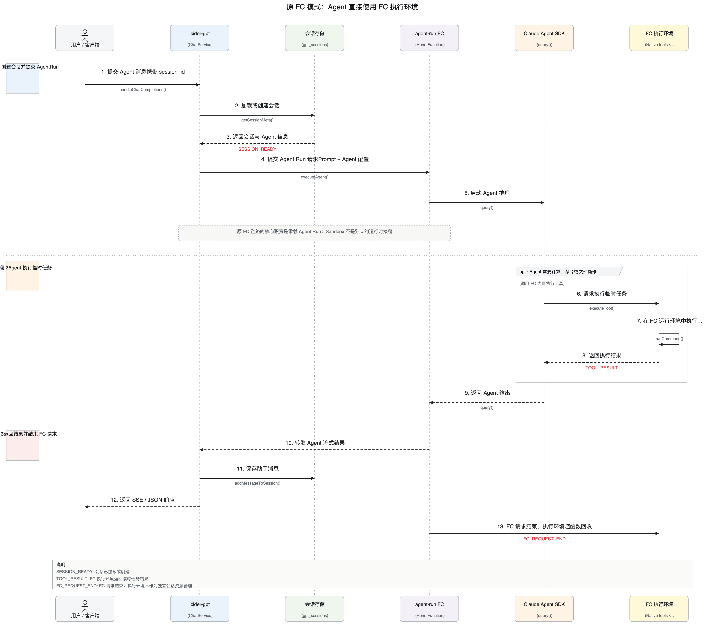
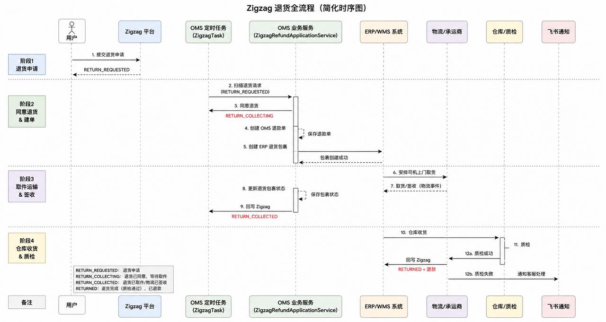
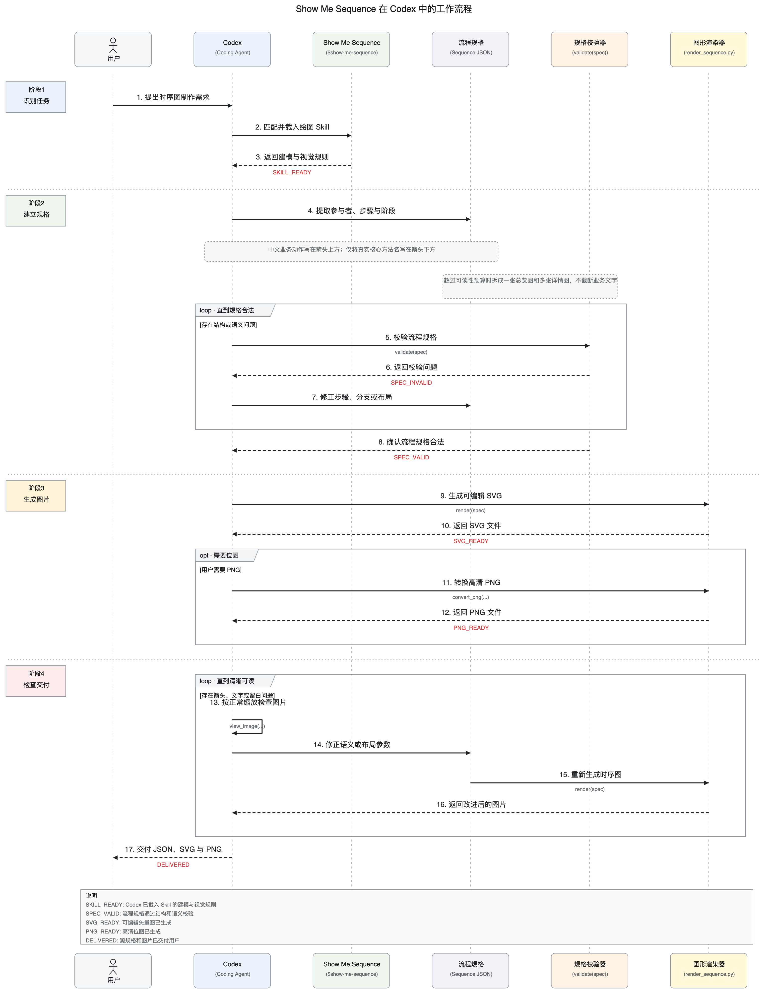

# Show Me Sequence

一个用于生成清晰、简洁 UML 时序图的 Codex Skill，适用于接口调用、审批流程、订单履约、事件流等业务场景。

## 图表特点

- 每个步骤都有明确的指向箭头
- 箭头上方写中文业务步骤
- 箭头下方只写英文核心方法名
- 返回步骤使用虚线，调用步骤使用实线
- 自动整理阶段、分支、循环和参与者布局
- 支持输出 SVG 和高清 PNG

## 参考效果





## 在 Codex 中如何工作

Codex 先载入 Skill 规则，把用户描述整理成 JSON 流程规格；规格通过校验后生成 SVG，并按需转换为 PNG。图片不清晰时，会调整规格或布局后重新渲染。



## 代码结构

```text
show-me-sequence/
├── SKILL.md
├── LICENSE
├── agents/openai.yaml
├── scripts/
│   ├── render_sequence.py
│   └── test_render_sequence.py
├── references/
│   ├── specification.md
│   └── sequence.schema.json
├── assets/example-sequence.json
└── docs/images/
```

- `SKILL.md`：Skill 的入口，告诉 Codex 何时启用以及如何建模、校验、渲染和检查图片。
- `LICENSE`：MIT 开源协议，允许自由使用、修改和分发。
- `agents/openai.yaml`：Codex 界面中显示的名称、简介和默认调用提示。
- `scripts/render_sequence.py`：核心程序，校验 JSON，并生成 SVG 或高清 PNG。
- `scripts/test_render_sequence.py`：回归测试，防止箭头、文字位置和布局在修改后失效。
- `references/specification.md`：JSON 字段和业务建模规则说明。
- `references/sequence.schema.json`：机器可读的 JSON Schema，用于检查输入结构。
- `assets/example-sequence.json`：可直接复制修改的完整示例。
- `docs/images/`：README 使用的参考图片，不参与 Skill 执行。

## 安装

```bash
git clone https://github.com/Layau-code/show-me-sequence.git \
  ~/.codex/skills/show-me-sequence
```

重启 Codex 后即可使用。

## 使用

直接告诉 Codex：

```text
使用 $show-me-sequence，把下面的业务流程生成 UML 时序图：
用户提交订单，订单服务创建订单，库存服务锁定库存，支付服务完成扣款。
```

Codex 会生成可继续编辑的 JSON、SVG，并按需生成 PNG。

## 手动渲染

```bash
python3 scripts/render_sequence.py input.json output.svg --preset web
```

完整字段说明见 [references/specification.md](references/specification.md)。

## 开源协议

本项目采用 [MIT License](LICENSE)。你可以自由使用、修改和分发，但需要保留原始版权与许可声明。
